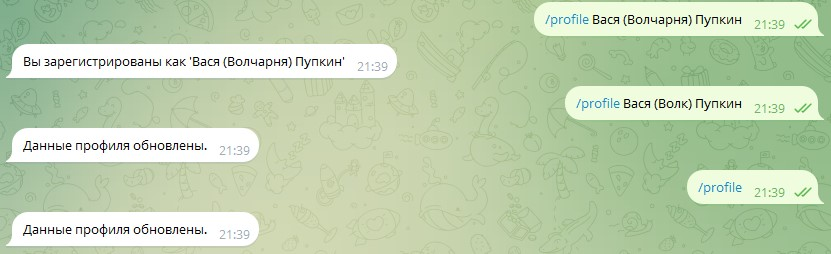
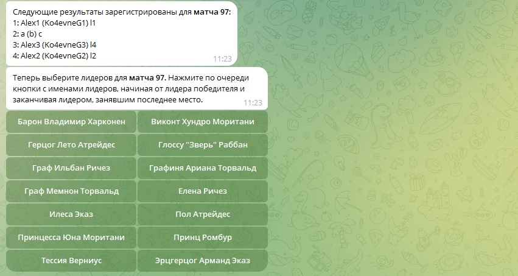

# <a id="home"/> РЕЙТИНГ-БОТ ДЮНЫ

### [Как использовать бота](#examples)
[Зачем нужен бот](#info)\
[Как найти бота](#chat)\
[Список всех команд](#commands)\
[Регистрация игрока](#register)\
[Изменение данных игрока](#refresh-profile)\
[Создание опроса](#create-poll)\
[Удаление опроса](#delete-poll)\
[Регистрация результатов](#result-submit)\
[Дополнительные действия победившего игрока при регистрации результатов](#winner-actions)\
[Игроки-гости](#guest-players)\
[Хосты](#hosts)\
[Рейтинг](#rating)

## <a id="info"/> Зачем нужен бот
В данном телеграм-канале ведется рейтинг матчей по настольной игре Dune: Imperium/Uprising. Каждый месяц в чат
высылается отчет с победителями и результатами всех участвовавших в матче игроков. Данный бот существует для того, 
чтобы этот рейтинг работал в автоматическом режиме.

## <a id="chat"/> Как найти бота
Бота можно найти в Telegram по нику <b>@tabledune_bot</b>.\
<b><u>Все команды нужно отправлять боту в личном чате</u></b>.

# <a id="commands"/> Список всех команд

`/profile Имя (ник_steam) Фамилия` Регистрация игрока в рейтинге или изменение данных существующего игрока\
`/profile` Обновление данных из Telegram (только для зарегистрированных игроков)
`/new_dune` Создание опроса для классической Dune\
`/new_up4` Создание опроса для Dune Uprising (4 игрока)\
`/new_up6` Создание опроса для Dune Uprising (6 игроков). **Работает без регистрации результатов, только для сбора матча**.\
`/cancel` Удаление последнего опроса, созданного игроком\
`/submit ID_игры` Запуск регистрации результатов игры с номером **ID_игры**\
`/resubmit ID_игры` Запуск регистрации результатов игры заново. Возможно выполнить до трех раз на игру\
`/config host` Команда для сохранения пользовательских настроек (пока доступна только одна настройка - `host`)\
`/host` Команда для отправки в чат матча данных своего сервера Tabletop\
`/help` Помощь

[В начало...](#home)

## <a id="register"/> Регистрация игрока

Для участия в рейтинге необходима регистрация игрока в боте. Для регистрации просто выполните команду в личном чате с
ботом: `/profile Имя (ник_steam) Фамилия`. Нужно вводить именно в таком в формате: Имя и Фамилия - это ваши реальные
данные, а в скобках между ними указывается ваш ник в Steam.
При регистрации бот сохранит для рейтинга ваши данные и чат, в который будет в дальнейшем отправлять вам уведомления. 
К сожалению, всем текущим игрокам придется зарегистрироваться еще раз, так как в текущих таблицах нет данных об их телеграм чатах.\
**Внимание:** если вы уже заходили в опросы бота до регистрации, значит вы находитесь в статусе игрока-гостя. Чтобы закончить
регистрацию гостя, вам нужно выполнить команду `/profile Имя (ник_steam) Фамилия` в чате с ботом. Подробнее об
игроке-госте [тут](#guest-players)\
\
[В начало...](#home)

## <a id="refresh-profile"/> Изменение данных игрока

Изменить данные игрока возможно командой `/profile Имя (ник_steam) Фамилия` (ваши имя и фамилия для рейтинга).
Если вы поменяли данные в Telegram и хотите обновить только их, можно использовать команду в таком виде: `/profile`.
Изменять данные необходимо, например, если вы зарегистрировались с ошибкой или сменили ник в steam **или изменили имя в Telegram**.
Даже если вы хотите поменять только одно имя, необходимо выполнить команду с полным заполнением. То есть ввести данные в
том же формате, что и при регистрации: Имя и Фамилия - это ваши реальные данные, а в скобках между ними указывается ваш ник в Steam.\
**Обратите внимание** что если вы не выполните эту команду при изменении данных в Telegram, вам могут перестать приходить
уведомления о матчах и вы можете неправильно отображаться в рейтинге.

[В начало...](#home)

## <a id="create-poll"/> Создание опроса

Для создания опроса выполните команду `/new_dune` (классика) или `/new_up4` (апрайзинг на 4-х) или `/new_up6` 
(апрайзинг на 6-х). Когда в опросе будут все игроки (4 или 6), начнется минутный отсчет, по истечении которого, если из опроса никто
не выйдет, в чат опроса будет отправлено уведомление о готовности игры, а также **ID_игры** этой партии.\
\
[В начало...](#home)

## <a id="delete-poll"/> Удаление опроса

Удалить возможно только последний созданный опрос, по которому еще не началась регистрация результатов.
Для удаления опроса выполните команду `/cancel`.\
\
[В начало...](#home)

## <a id="result-submit"/> Регистрация результатов

По окончании игры, необходимо зарегистрировать ее результаты. Для запуска регистрации выполните команду `/submit ID_игры`.
Команду может выполнить любой игрок, участвующий в матче. При выполнении команды, **всем** положительно ответившим в опросе
игрокам будет выслано сообщение с опциями выбора занятого места. Как только каждый игрок укажет свое место, будет проведена
валидация результата - если несколько игроков претендуют на одно место, процесс регистрации начнется повторно. Бот
разрешает 3 повторных
попытки для регистрации результата. Если консенсус не будет достигнут, регистрация закроется и результат матча не будет
учитываться в рейтинге. Также повторную регистрацию результатов можно вызвать командой `/resubmit ID_игры` - например в
случае, если по ошибке было выбрано неправильное место. В этом случае, бот отправит всем участникам повторный опрос
выбора места. Вызов этой команды также уменьшает количество повторных попыток регистрации.\
В случае, когда кто-то из игроков не отвечает на запрос регистрации результата, матч будет завершен автоматически через
20 минут. Если не отвечает игрок, ответивший в опросе положительно, но не участвующий в матче (пятый игрок), то матч
будет
учтен в рейтинге, в противном случае - матч не будет учитываться.\
_<pre>В реализации: Игроки регулярно не отвечающие на запрос результатов, либо регулярно вызывающие конфликт, указывая
чужие места, будут баниться из рейтинга на возрастающий с каждым нарушением срок.</pre>_
[В начало...](#home)

## <a id="winner-actions"/> Дополнительные действия победившего игрока при регистрации результатов

Кроме опроса места, у победителя есть задача загрузить скриншот матча. После выбора первого места на регистрации результатов,
ему придет запрос на загрузку скриншота. Для загрузки нужно просто перетащить скриншот в чат с ботом, после получения запроса.
Загрузить можно только картинку (не файл!), как сжатую Telegram, так и не сжатую. Максимальный размер скриншота: 6.5 Мб, 
разрешенные форматы: jpg, jpeg, png.\
_<pre>В реализации: После загрузки скриншота, победителю также придет дополнительный опрос с просьбой указать лидера,
которым он играл.</pre>_
После загрузки скриншота также придет сообщение с предложением выбрать лидера, которым победитель играл. Нужно просто 
нажать на кнопку соответствующего лидера. После выбора, матч будет завершен и его результат зарегистрирован в рейтинге.\
[В начало...](#home)

## <a id="guest-players"/> Игроки-гости

Игроки без регистрации так же могут принять участие в матче - им точно так же придут запросы на выбор места и загрузку 
скриншота. Однако на таких игроков наложен ряд ограничений:
- не участвуют в рейтинге
- не могут создавать матчи 
- не могут использовать часть команд бота
- имеют имя Vasya (guest111) Pupkin

[В начало...](#home)

## <a id="hosts"/> Хосты

Игроки могут сохранить у бота данные своего сервера, чтобы в дальнейшем высылать их в чат матча по команде.
Для сохранения сервера используйте команду `/config host text`, **text** - это текст вашего сообщения с данными сервера,
он
будет отправляться в точно таком же виде, как вы его введете при выполнении команды.\
_Пример_: команда `/config host ААА ! ыыы` сохранит для отправки игрокам текст 'ААА ! ыыы'.\
Чтобы отправить свой сервер в чат выполните команду `/host`. При выполнении команды, будет выбран **последний** матч, в
опросе которого вы ответили 'да', и в чат с этим опросом будут отправлены данные вашего сервера.

[В начало...](#home)

## <a id="rating"/> Рейтинг

По окончании месяца, в чат будет выслан pdf файл с результатами рейтинга за этот месяц.\
Формула расчета эффективности сохранена из старого рейтинга:

_<pre>В реализации: 15 числа месяца, в чат будет выслан pdf файл с промежуточными результатами этого месяца.</pre>_
[В начало...](#home)

# <a id="examples"/>Как использовать бота

### Регистрация и обновление данных профиля

### Создание матча

Сообщение о сборе в соответствующем чате (классика или uprising):\
\

Сообщение через минуту, после сбора 4 игроков\

### Регистрация результатов

Запрос на регистрацию (от любого участника). ID матча (в данном примере = 1) можно взять из сообщения о сборе опроса:\

Опрос для каждого игрока:\

Когда все проголосовали (запрос скриншота только у победителя):\

Загрузка скриншота:\

Сообщение о результатах в соответствующем чате (классика или uprising):\

### Конфликт результатов

Превышение лимита конфликтов результатов:\

Сообщение о результатах в соответствующем чате (классика или uprising):\

[В начало...](#home)
